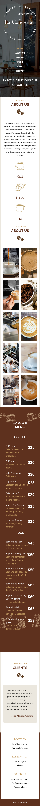

# Cafeteria
Live Site URL: [GitHub Pages](https://jaac97.github.io/cafeteria/)
This is a solution to the [Coffee Shop Lading page with BEM and SASS](https://www.udemy.com/course/css-grid-y-flexbox-la-guia-definitiva-crea-10-proyectos/learn/lecture/28249668#questions). CSS La Guía Completa - Flexbox, CSS Grid, SASS +20 proyectos challenges help you improve your coding skills by building realistic projects. 

## Table of contents

- [Overview](#overview)
  - [Links](#links)
- [My process](#my-process)
  - [Built with](#built-with)

- [Author](#author)
- [Screenshot](#screenshot)
    - [Mobile](#mobile)

## Overview

### Links

- Solution URL: [GitHub](https://github.com/jaac97/cafeteria)
- Live Site URL: [GitHub Pages](https://jaac97.github.io/cafeteria/)

## My process

### Built with

- Semantic HTML5 markup
- CSS custom properties
- Flexbox
- Grid
- Block Element Modifier
- Mobile-first workflow
- Syntactically Awesome Style Sheets
- GULP

## Author

- LinkedIn - [Josué Alarcón](https://www.linkedin.com/in/josue-alarcon-camino/)
- Github - [@jaac97](https://github.com/jaac97)
- Frontend Mentor - [@jaac97](https://www.frontendmentor.io/profile/jaac97)

### Screenshot
#### Mobile

